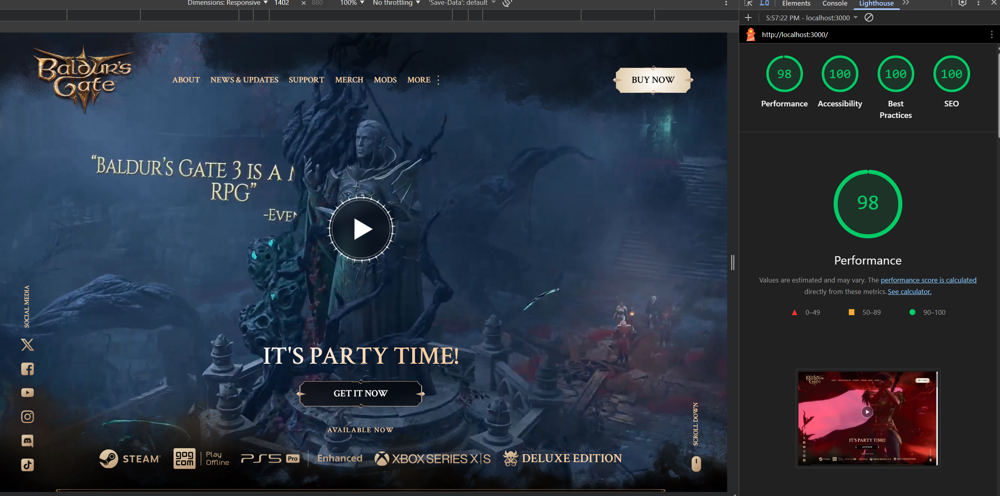
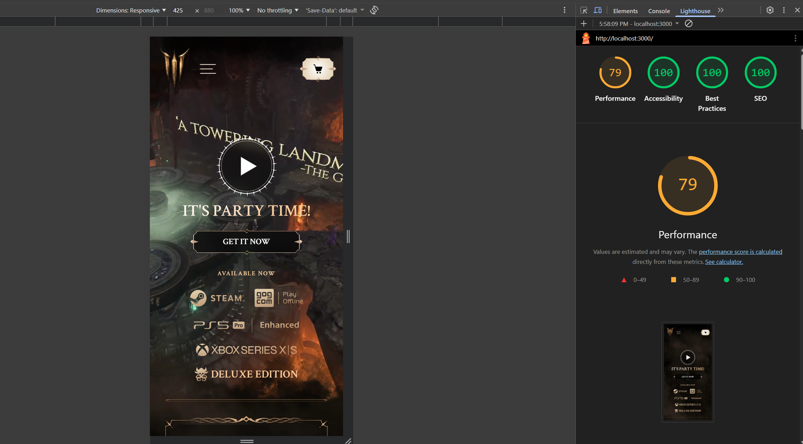

# Baldur's Gate 3 Homepage Clone

A **Baldur's Gate 3** homepage clone built with **Next.js**, **React**, **TypeScript**, and **Tailwind CSS**. This project recreates the main page website layout, styling, and interactive elements with some modifications for portfolio purposes.

## 🔹 Features

- Fully responsive design
- Built with **Next.js** and **React** for modern web architecture
- Styled with **Tailwind CSS** for rapid and scalable UI development
- TypeScript support for type safety
- Interactive components like hero section, character showcases, and navigation
- Optimized for performance and fast loading

## 🛠 Tech Stack

- **Next.js**
- **React**
- **TypeScript**
- **Tailwind CSS**

## 📂 Project Structure

```
/app
  globals.css       # Global styles
  layout.tsx        # App layout
  not-found.tsx     # 404 page
  page.tsx          # Main homepage

/components
  /common           # Reusable UI components
  /icons            # Icon components
  /layout           # Layout-specific components
  /UI               # Other UI elements

/data               # TypeScript data files for heroes, characters, etc.

/public
  /icons            # SVG or other icons
  /images           # Images for heroes, backgrounds, etc.
  /videos           # Video assets

/assets
  /docs             # Images for my README file
```

## 🚀 Getting Started

### 1. Clone the repo

```bash
git clone https://github.com/yourusername/baldurs-gate3-clone.git
cd baldurs-gate3-clone
```

### 2. Install dependencies

```bash
npm install
# or
yarn
```

### 3. Run development server

```bash
npm run dev
# or
yarn dev
```

Open [http://localhost:3000](http://localhost:3000) to view it in your browser.

### 4. Build for production

```bash
npm run build
npm start
# or
yarn build
yarn start
```

## 📊 Lighthouse Performance Scores

**Desktop**


**Mobile**


## 📄 License

This project is **for portfolio purposes only**.
All Baldur's Gate 3 assets belong to **Larian Studios**.
